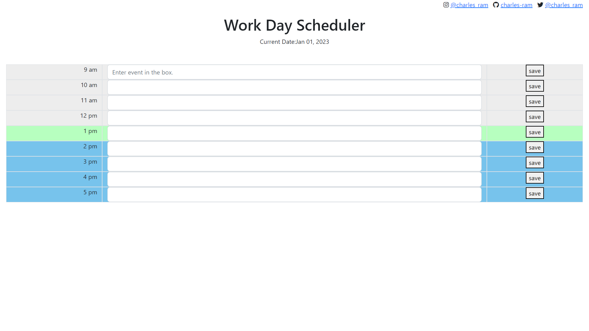

# Work Day Scheduler

## Description

This project is a work day scheduler with time blocks from 9-5. The project uses bootstrap for the styling and certain jquery features to interact with the page.

## Installation

To install this application, download the file in the Github.

## Prerequisites

In order to install this application and edit the code you must have a text editor installed. The one I used for this project was Studio Visual Code. This project also uses web API's so be sure to check if the jquery library and the bootstrap library are up to date.

## Features

The project includes certain features that help to organize and manage your time during a work day. The first feature displays the current date under the title. The second feature gives the user the ability to save events to the local storage so they will not be deleted upon page refresh. The third feature uses the user's current time to display different background colors of each time block. Time blocks that have passed are colored gray, current time blocks are colored green, and upcoming time blocks are colored blue.

## Usage

The current date will automatically render on page load. The colored time blocks will also automatically render on page load. To save events, the user must enter the event in the input box and click the save button to save the event to local storage.

### Current Date

### Colored Time Blocks

## Links
[GitHub](https://github.com/charles-ram/m5-work-day-calendar)
[Launched-Site](https://charles-ram.github.io/m5-work-day-calendar/)